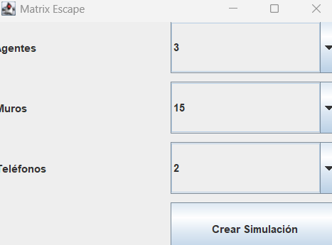
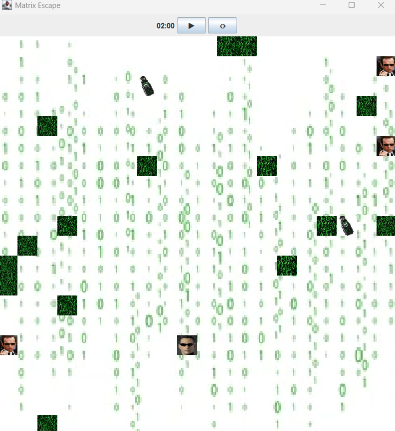
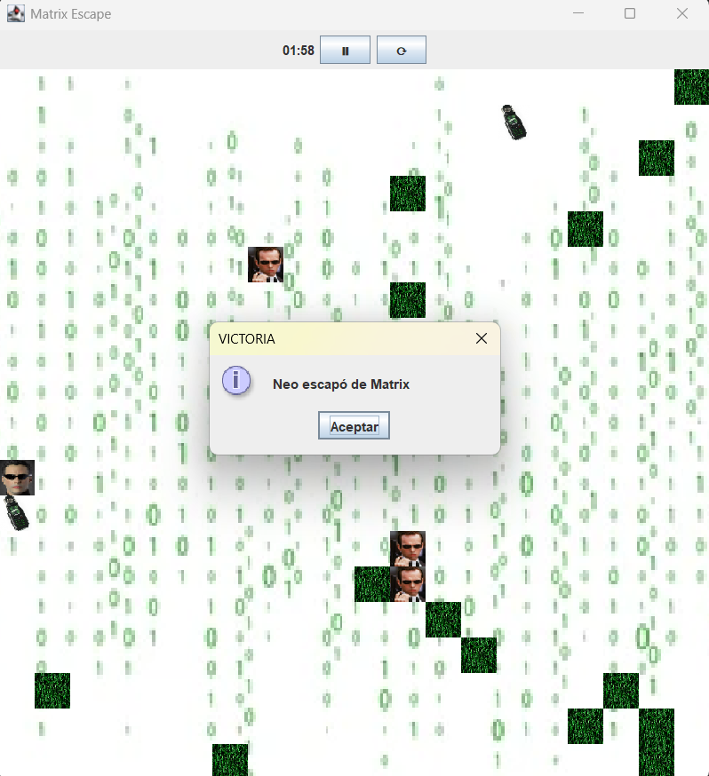
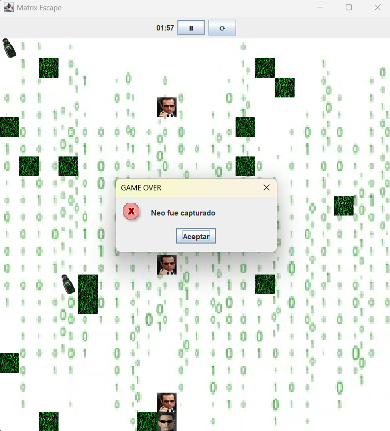

# ARSW - Project: Matrix Escape

**Author:** Eduardo Rico Duarte

**Course:** Software Architectures (ARSW)

**Institution:** Escuela Colombiana de Ingeniería Julio Garavito

---

# Introduction

This project consists of the development of a simulation inspired by *The Matrix*, where the main character, Neo, must escape the Matrix by reaching one of the available telephones on the map before being captured by the agents.

The simulation takes place on a two-dimensional grid and allows the user to dynamically configure the number of agents, walls, and telephones that will participate in each execution. The behavior of all characters is automatic, allowing the simulation to evolve autonomously once started.

---

# Theoretical Framework

Concurrent applications allow multiple tasks to execute seemingly simultaneously through the use of threads. This approach is especially useful in simulations, video games, and interactive systems, where different elements must update their behavior independently without blocking the overall execution of the program.

In Java, threads make it possible to model autonomous entities that evolve over time. However, when multiple components interact within a shared environment, their execution must be coordinated to ensure system consistency and prevent unexpected behaviors.

---

# Objectives

## General Objective

Develop a graphical simulation based on the Matrix universe, applying software architecture concepts such as concurrency to model the autonomous behavior of multiple entities within a shared environment.

## Specific Objectives

* Implement a two-dimensional grid representing the simulation environment.
* Allow the user to configure the number of agents, walls, and telephones before starting the simulation.
* Implement the automatic behavior of Neo and the agents.
* Manage victory and defeat conditions.

---

# Development

## Simulation Design

An 18 × 18 grid was implemented, reusing part of the infrastructure previously developed in the **BadDopoIceCream** project, especially the board matrix representation and the overall domain organization.

The model was structured using two main hierarchies:

### Entities

These correspond to the elements capable of moving within the grid.

* **Neo**

  * Main character.
  * Automatically moves toward the nearest telephone.
  * Loses the game if captured by an agent.

* **Agent**

  * Enemy of the simulation.
  * Automatically moves toward Neo's current position.
  * Cannot pass through walls or occupy telephone cells.

### Blocks

These represent static elements of the environment.

* **Wall**

  * Obstacle that blocks the movement of both Neo and the agents.

* **Telephone**

  * Escape point for Neo.
  * If Neo reaches a telephone, the simulation ends successfully.
  * For agents, telephones behave as blocked cells.

---

## Dynamic Configuration

Before starting the simulation, the user can select:

* Number of agents: between 1 and 5.
* Number of walls: between 1 and 15.
* Number of telephones: between 1 and 4.

All elements are randomly placed on the board.

As an additional constraint, a safety zone of three cells in every direction is created around Neo's initial position, preventing agents, walls, or telephones from spawning too close to the player at the beginning of the game.

---

## Graphical User Interface

The application was divided into two main windows:

### Main Menu

Allows the user to:

* Select the number of agents.
* Select the number of walls.
* Select the number of telephones.
* Start the simulation.

### Game Level

Contains:

* Graphical representation of the grid.
* Countdown timer.
* Start button.
* Pause and resume button.
* Visual representation of Neo, agents, walls, and telephones through images.

---

## End Conditions

The simulation can end in three different ways:

### Victory

Neo reaches any of the telephones present on the board.

### Defeat by Capture

An agent reaches Neo's position.

### Defeat by Time Limit

The countdown timer reaches zero before Neo reaches a telephone.

---

## Concurrency Implementation

One of the main aspects of the project was the incorporation of concurrency to represent the autonomous behavior of the simulation characters.

Neo and the agents operate independently through tasks that periodically update their positions on the grid. This allows all characters to act simultaneously within the same environment instead of following a strictly sequential execution flow.

The continuous updates of the entities make it possible to simulate the agents' pursuit behavior and Neo's search for telephones, generating a dynamic system similar to real concurrent applications.

To maintain consistency, all movements respect the restrictions imposed by walls, telephones, and the limits of the grid.

---

# Execution

## Compile

```java
javac -d bin src/main/java/dominio/*.java src/main/java/presentacion/*.java
```

## Run
```java
java -cp bin main.java.presentacion.Matrix
```

# Evidence

## Configuration Menu



---

## Running Simulation


---

## Victory



---

## Defeat



---

# Conclusions

* A configurable simulation based on a two-dimensional grid was successfully implemented.
* Reusing components previously developed in the BadDopoIceCream project reduced implementation time and helped maintain an organized architecture.
* The project enabled the application of concurrency concepts studied during the course by modeling autonomous behaviors for Neo and the agents through independently executed tasks within the simulation.
* The simulation fulfills all the initially defined rules and provides autonomous behavior for both Neo and the agents.

---

# References

Benavides Navarro, L. D., & Gualtero Martínez, R. H. (2024). *Concurrency and Threads in Java and Go* [Course slides].

OpenAI. (2026). *ChatGPT (GPT-5.5 version)* [Large Language Model]. https://chatgpt.com/ (Used primarily as a support tool.)
